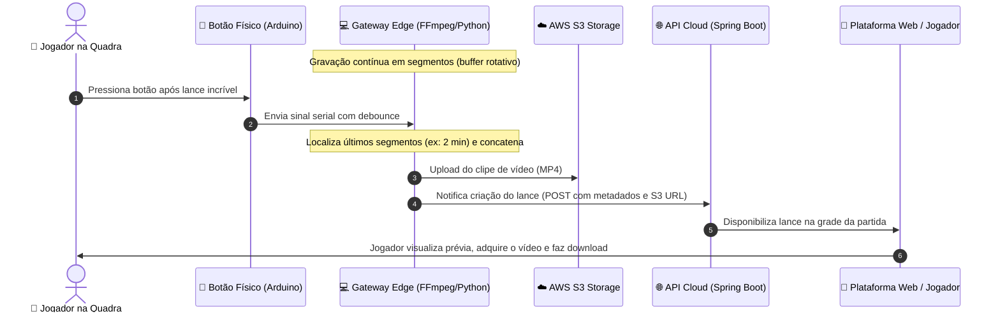

# ⚽ ClickLance — Sistema de Replay de Jogadas para Quadras de Futsal e Society

> Sistema inteligente de captura contínua, recorte instantâneo e disponibilização de lances esportivos via acionamento físico na quadra.

---

## 📌 Visão Geral do Produto

O **ClickLance** é uma solução completa ponta a ponta desenvolvida para quadras esportivas (futsal e society). O produto permite que os jogadores marquem os melhores momentos de suas partidas pressionando um botão físico instalado diretamente na quadra — **sem precisar manusear smartphones durante o jogo**.

As câmeras permanecem gravando continuamente em um buffer local. Ao acionar o botão, o sistema recupera a janela de tempo anterior ao lance, concatena os segmentos de vídeo sem perda de performance e envia o clipe para a nuvem. Posteriormente, os jogadores acessam a plataforma web da quadra, encontram suas partidas pelo horário e adquirem seus lances sob demanda.

> 📄 **Documento de referência:** Detalhes completos de concepção de negócio e requisitos constam em [`docs/documento_visao_produto_replay_quadras_v0_1.pdf`](docs/documento_visao_produto_replay_quadras_v0_1.pdf).

---

## 🔄 Fluxo de Funcionamento



---

## 🏗️ Arquitetura do Ecossistema

O ecossistema ClickLance é dividido em 4 camadas principais:

```
clickLance/
├── botao_local/            # Firmware do dispositivo físico na quadra (Arduino)
├── gateway_captura/        # Equipamento local de gravação e processamento (Edge PC)
├── docs/                   # Documentações de visão de produto e status do projeto
└── [Cloud / Backend]*      # Infraestrutura em nuvem, API Spring Boot e Web (Backlog)
```

### 1. Dispositivo Físico de Acionamento (`botao_local/`)
- **Hardware:** Arduino Mega / Uno com display LCD I2C e botão push-button / arcade de alta resistência.
- **Função:** Captura a intenção do jogador em tempo real na quadra, exibe feedback visual no display e dispara o evento serial (`Botao foi Pressionado!`) para o computador local.
- **Resiliência:** Tratamento de estado para evitar disparos duplicados (*debounce* elétrico de hardware e software).

### 2. Equipamento Local / Gateway Edge (`gateway_captura/`)
- **Tecnologia:** Python 3.10+ multithreading integrado ao **FFmpeg** via linha de comando DirectShow.
- **DVR Manager:** Grava a câmera da quadra continuamente em segmentos curtos (ex: 60s) usando segmentador nativo do FFmpeg, mantendo um buffer local rotativo com limpeza automática por tempo de retenção configurável.
- **Serial Listener:** Monitora a porta USB/COM do Arduino de forma assíncrona, aplicando *debounce* adicional de 5 segundos contra múltiplos cliques acidentais.
- **Video Processor (Worker):** Ao ser notificado pelo botão, junta os segmentos correspondentes à janela do lance sem re-encoding (usando demuxer `concat` do FFmpeg), realiza o upload para o **AWS S3** e notifica a **API Cloud**.
- **Test Pipeline:** Utilitário autônomo para validação local de câmera, FFmpeg e simulação de cliques offline.

### 3. Backend & Cloud Platform (Em desenvolvimento)
- **Armazenamento:** AWS S3 com políticas de retenção e distribuição rápida via Amazon CloudFront.
- **Backend API:** Desenvolvida em Java com **Spring Boot**, gerencia empresas, quadras, partidas, eventos, lances e pedidos.
- **Arquitetura Multi-Tenant:** Um banco de dados centralizado com segregação lógica por identificadores de empresa/quadra.
- **Pagamentos:** Gateway externo (ex: Stripe, Mercado Pago ou Asaas) com tokenização de cartões sem armazenamento de dados sensíveis na aplicação (conformidade PCI).

### 4. Plataforma Web do Usuário (`plataforma_web/`, em desenvolvimento)
- **Tecnologia:** Next.js 16 + React 19 + TypeScript + Tailwind CSS 4, mobile-first e instalável como PWA.
- **API mockada:** roda sem backend; a troca para a API real é feita por variável de ambiente. Detalhes em [`plataforma_web/README.md`](plataforma_web/README.md).
- **Como rodar:** `cd plataforma_web`, `npm install`, `cp .env.example .env` e `npm run dev`.

Escopo original planejado:
- Consulta de partidas por data e faixa de horário (ex: 20h–21h, 21h–22h).
- Pré-visualização de lances e compra individual ou por pacotes.
- Área do cliente com reprodução e download dos vídeos adquiridos.

---

## 📋 Mapeamento de Requisitos (Visão v0.1)

| Código | Requisito | Módulo | Status |
|---|---|---|:---:|
| **RF01** | Registrar acionamentos do botão físico | `botao_local` + `gateway_captura` | ✅ Concluído |
| **RF02** | Acionamento com timestamp e identificação da quadra | `gateway_captura` (`config.py`) | ✅ Concluído |
| **RF03** | Associar o evento à partida correspondente | Backend Cloud | ⏳ Backlog |
| **RF04** | Recuperar trecho de vídeo correspondente ao evento | `gateway_captura` (`dvr_manager.py`) | ✅ Concluído |
| **RF05** | Janela de captura configurável por parâmetro | `gateway_captura` (`.env`) | ✅ Concluído |
| **RF06** | Processar o trecho e gerar clipe final | `gateway_captura` (`video_processor.py`) | ✅ Concluído |
| **RF07** | Disponibilizar clipe na plataforma web | Cloud API + Frontend | ⏳ Backlog |
| **RF08** | Localizar lances por quadra/data/horário | Frontend Web | ⏳ Backlog |
| **RF09** | Cadastro e autenticação única de usuário | Backend Cloud | ⏳ Backlog |
| **RF10** | Pagamento via gateway externo tokenizado | Backend Cloud | ⏳ Backlog |
| **RF11** | Liberação imediata do acesso após pagamento | Backend Cloud | ⏳ Backlog |
| **RF12** | Plataforma multi-tenant com isolamento lógico | Backend Cloud | ⏳ Backlog |
| **RNF01** | Gravação contínua sem interrupções | `dvr_manager.py` (FFmpeg) | ✅ Concluído |
| **RNF02** | Tempo de processamento até disponibilidade < 5 min | Pipeline Edge otimizado (~alguns seg.) | ✅ Concluído |
| **RNF03** | Janela de captura alterável sem refatoração | Parametrização via `.env` | ✅ Concluído |
| **RNF04** | Segurança de cartões (PCI-DSS via tokenização) | Gateway Pagamento | ⏳ Backlog |
| **RNF05** | Isolamento lógico entre empresas e quadras | Backend Multi-tenant | ⏳ Backlog |
| **RNF06** | Escalabilidade sem banco individual por quadra | Arquitetura Cloud | ⏳ Backlog |

---

## 🚦 Status Atual do Projeto e Roadmap

Consulte o documento detalhado em [`docs/status_projeto.md`](docs/status_projeto.md).

### ✅ Concluído (Edge Local)
- [x] Estrutura do Gateway Edge em Python com arquitetura multithreading.
- [x] Gravação segmentada contínua (`dvr_manager.py`) com FFmpeg DirectShow.
- [x] Política de expiração e limpeza automática de segmentos em disco (`RETENTION_HOURS`).
- [x] Leitura serial com *debounce* temporal de 5s no Python e tratamento no Arduino.
- [x] Concatenação de segmentos sem re-encoding (alta velocidade, sem sobrecarga de CPU).
- [x] Cliente de upload para AWS S3 (`boto3`) e disparo de webhook HTTP POST (`requests`).
- [x] Script de teste de bancada e diagnóstico de hardware (`test_pipeline.py`).

### 🚀 Próximos Passos (Backlog Geral)

1. **Infraestrutura Cloud (AWS):**
   - Criação e configuração do Bucket S3 dedicado aos lances.
   - Configuração de Bucket Policy / CloudFront para entrega pública/assinada de vídeo.
   - Geração de credenciais IAM para os computadores locais de cada quadra.

2. **Backend Cloud (Java / Spring Boot):**
   - Criação da API REST `/api/replays` para recepção do webhook do gateway.
   - Modelagem de dados relacional: Empresa, Quadra, Equipamento, Partida, Evento, Clipe e Compra.
   - Endpoints de consulta de partidas e lances para o cliente final.
   - Integração com provedor de pagamento externo (checkout transparente / tokenização).

3. **Evolução do Gateway Edge:**
   - **Fila de retentativas offline:** Persistência local para tolerância a falhas temporárias de conexão na quadra.
   - **Auto-Start Windows:** Criação de serviço ou script `.bat` no inicializador do Windows para recuperação automática após queda de energia.
   - **Monitoramento e Heartbeat:** Envio periódico de telemetria para garantir que as quadras estão operacionais.

---

## 🚀 Como Iniciar

### 1. Dispositivo Físico (Arduino)
1. Conecte o Arduino à porta USB do computador.
2. Abra [`botao_local/botao_local.ino`](botao_local/botao_local.ino) na Arduino IDE.
3. Certifique-se de ter a biblioteca `LiquidCrystal_I2C` instalada.
4. Selecione a placa (ex: Arduino Mega ou Uno), a porta COM e faça o upload.

### 2. Gateway de Captura (Edge PC)
1. Instale o **Python 3.10+** e o **FFmpeg** (adicione o FFmpeg ao `PATH` do sistema).
2. Acesse a pasta do módulo:
   ```powershell
   cd gateway_captura
   ```
3. Instale as dependências:
   ```powershell
   pip install -r requirements.txt
   ```
4. Crie o arquivo `.env` a partir do modelo:
   ```powershell
   cp .env.example .env
   ```
5. Identifique o nome da câmera no Windows:
   ```powershell
   ffmpeg -list_devices true -f dshow -i dummy
   ```
6. Ajuste as variáveis no `.env` (porta serial, nome da câmera, identificador da quadra, etc.).
7. Para validar seu hardware e simular cortes offline sem dependências de nuvem:
   ```powershell
   python test_pipeline.py
   ```
8. Para executar a aplicação em produção:
   ```powershell
   python main.py
   ```

---

## 📚 Documentação Adicional

- 📄 [`docs/documento_visao_produto_replay_quadras_v0_1.pdf`](docs/documento_visao_produto_replay_quadras_v0_1.pdf): Documento formal de levantamento inicial e visão de produto.
- 📋 [`docs/status_projeto.md`](docs/status_projeto.md): Relatório de progresso técnico e backlog do módulo Edge e Cloud.
- 💻 [`gateway_captura/README.md`](gateway_captura/README.md): Guia técnico detalhado do Gateway de Captura.
