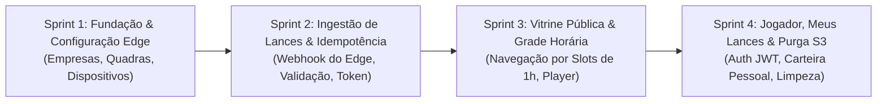

# 📋 ClickLance — Histórias de Usuário (Sprints) e Especificação de APIs (Frontend & Edge)

> Documento oficial de planejamento ágil e especificação de contratos de API REST para o Backend Cloud do **ClickLance (MVP)**.  
> Derivado diretamente das especificações em [`docs/requisitos_e_regras_mvp.md`](requisitos_e_regras_mvp.md) e [`docs/modelagem_banco_de_dados.md`](modelagem_banco_de_dados.md).

---

## 🧭 Visão Geral das Sprints do MVP

O backlog foi organizado em **4 Sprints lógicas e incrementais**, desenhadas para desbloquear o desenvolvimento do Frontend e garantir que cada sprint entregue valor testável:



---

# 🚀 SPRINT 1: Fundação, Multi-tenancy e Sincronização do Edge

> **Objetivo:** Estabelecer a infraestrutura de dados no backend, cadastros administrativos e o endpoint que fornece ao computador local (Edge) os parâmetros de corte de vídeo.

---

### 📝 US-01 — Cadastro de Empresa e Política de Retenção
* **Como** Administrador da Plataforma,  
* **Quero** cadastrar uma empresa operadora de quadras definindo seu tempo de retenção pública (ex: 2 dias),  
* **Para que** todas as quadras pertencentes a essa empresa herdem as regras de expiração e isolamento de dados.

#### Critérios de Aceite:
1. Deve ser obrigatório informar `nome` e opcional informar `dias_retencao_padrao` (default: 2 dias se omitido).
2. O campo `dias_retencao_padrao` deve ser maior que zero (*RN-MVP-01*).
3. O retorno deve conter o `id` gerado no formato UUID v4.

#### 🔌 Especificação da API:

##### `POST /api/v1/empresas`
* **Descrição:** Cria uma nova empresa operadora de quadras esportivas.
* **Autenticação:** Aberta no MVP / Admin.
* **Headers:** `Content-Type: application/json`
* **Request Body:**
  ```json
  {
    "nome": "Arena Society Gol de Placa",
    "dias_retencao_padrao": 2
  }
  ```
* **Response (201 Created):**
  ```json
  {
    "id": "11111111-1111-1111-1111-111111111111",
    "nome": "Arena Society Gol de Placa",
    "dias_retencao_padrao": 2,
    "ativo": true,
    "criado_em": "2026-10-07T10:00:00Z"
  }
  ```

---

### 📝 US-02 — Cadastro e Configuração de Quadra
* **Como** Administrador da Empresa,  
* **Quero** cadastrar quadras vinculadas à minha empresa configurando os tempos do buffer do DVR,  
* **Para que** o hardware daquela quadra saiba o tamanho dos arquivos e a janela de corte das jogadas.

#### Critérios de Aceite:
1. A quadra deve estar obrigatoriamente vinculada a uma empresa existente (*RN-MVP-02*).
2. Deve ser possível configurar `duracao_segmento_segundos` (default: 60) e `segmentos_concatenar` (default: 2) (*RN-MVP-11*).
3. Deve retornar erro `404 Not Found` caso a empresa informada não exista.

#### 🔌 Especificação da API:

##### `POST /api/v1/quadras`
* **Descrição:** Cria uma nova quadra esportiva vinculada a uma empresa.
* **Request Body:**
  ```json
  {
    "empresa_id": "11111111-1111-1111-1111-111111111111",
    "nome": "Quadra 1 - Futsal Principal",
    "duracao_segmento_segundos": 60,
    "segmentos_concatenar": 2
  }
  ```
* **Response (201 Created):**
  ```json
  {
    "id": "22222222-2222-2222-2222-222222222222",
    "empresa_id": "11111111-1111-1111-1111-111111111111",
    "nome": "Quadra 1 - Futsal Principal",
    "duracao_segmento_segundos": 60,
    "segmentos_concatenar": 2,
    "ativo": true,
    "criado_em": "2026-10-07T10:05:00Z"
  }
  ```

---

### 📝 US-03 — Cadastro de Dispositivo (Botão) e Emissão de Token
* **Como** Instalador/Técnico de Hardware,  
* **Quero** cadastrar um botão físico atrelando-o a uma quadra e receber sua credencial de acesso,  
* **Para que** o Gateway Edge utilize esse token para autenticar o envio de replays com segurança.

#### Critérios de Aceite:
1. O identificador `id` deve ser informado (ex: `disp_001`) (*RN-MVP-04*).
2. O dispositivo deve estar vinculado a uma quadra existente (*RN-MVP-03*).
3. O endpoint deve gerar um token aleatório criptograficamente seguro (`token_acesso`), armazenar apenas o seu hash (`token_acesso_hash`) no banco (*RN-MVP-07*) e retornar o token em texto puro **uma única vez** na resposta da criação.

#### 🔌 Especificação da API:

##### `POST /api/v1/dispositivos`
* **Descrição:** Cadastra um botão/dispositivo físico e gera sua chave de acesso.
* **Request Body:**
  ```json
  {
    "id": "disp_001",
    "quadra_id": "22222222-2222-2222-2222-222222222222",
    "descricao": "Botão Arcade Vermelho - Entrada Analógica 1"
  }
  ```
* **Response (201 Created):**
  ```json
  {
    "id": "disp_001",
    "quadra_id": "22222222-2222-2222-2222-222222222222",
    "descricao": "Botão Arcade Vermelho - Entrada Analógica 1",
    "token_acesso": "sec_dev_quadra1_btn01_abc123xyz789",
    "ativo": true,
    "criado_em": "2026-10-07T10:10:00Z"
  }
  ```

---

### 📝 US-04 — Consulta de Configurações Operacionais pelo Edge
* **Como** Software do Gateway Edge (Python),  
* **Quero** consultar minhas configurações de captura ao inicializar,  
* **Para que** o FFmpeg e o gravador utilizem os valores de buffer e corte definidos para a minha quadra.

#### Critérios de Aceite:
1. O Edge deve enviar o header `X-Device-Token` com a credencial válida (*RN-MVP-05*).
2. Se o token for inválido ou o dispositivo estiver inativo, retornar `401 Unauthorized` (*RN-MVP-06*).
3. Retorna a duração dos segmentos e a quantidade de segmentos a concatenar configuradas na quadra (*RN-MVP-11*).

#### 🔌 Especificação da API:

##### `GET /api/v1/dispositivos/{id}/config`
* **Headers:** `X-Device-Token: sec_dev_quadra1_btn01_abc123xyz789`
* **Response (200 OK):**
  ```json
  {
    "dispositivo_id": "disp_001",
    "quadra_id": "22222222-2222-2222-2222-222222222222",
    "quadra_nome": "Quadra 1 - Futsal Principal",
    "duracao_segmento_segundos": 60,
    "segmentos_concatenar": 2
  }
  ```
* **Response (401 Unauthorized):**
  ```json
  {
    "erro": "Dispositivo inativo ou credencial inválida."
  }
  ```

---

# 🚀 SPRINT 2: Ingestão de Lances do Edge e Idempotência

> **Objetivo:** Implementar o endpoint de recepção de lances já processados pelo Edge, garantindo resolução automática da quadra, validação de token e proteção contra cliques duplos.

---

### 📝 US-05 — Ingestão Autenticada e Idempotente de Lance
* **Como** Gateway de Captura (Edge PC),  
* **Quero** notificar o backend assim que o clipe for concatenado e enviado ao S3,  
* **Para que** o replay seja registrado no banco de dados e fique imediatamente disponível na quadra.

#### Critérios de Aceite:
1. A requisição deve conter o header `X-Device-Token` com credencial válida do dispositivo informado no payload (*RN-MVP-05, RN-MVP-06*).
2. O backend identifica automaticamente a quadra a partir do cadastro do dispositivo (*RN-MVP-08*).
3. **Idempotência (RN-MVP-14):** Se o mesmo `dispositivo_id` enviar outro evento com diferença menor que 5 segundos em relação a um já registrado, o backend não cria um novo registro e responde com status `200 OK` retornando o lance já existente.
4. O lance é criado com `status = 'DISPONIVEL'` (*RN-MVP-15*).
5. A data `expira_em` é calculada automaticamente como: `timestamp_evento + dias_retencao_padrao` da empresa dona da quadra (*RN-MVP-16*).
6. O backend armazena tanto a `video_url` quanto a `s3_key` extraída da URL (*RN-MVP-20*).

#### 🔌 Especificação da API:

##### `POST /api/v1/replays`
* **Descrição:** Webhook único consumido pelo Edge para registrar um novo lance gerado.
* **Headers:**
  ```http
  Content-Type: application/json
  X-Device-Token: sec_dev_quadra1_btn01_abc123xyz789
  ```
* **Request Body:**
  ```json
  {
    "dispositivo_id": "disp_001",
    "timestamp": "2026-10-07T22:14:50Z",
    "video_url": "https://clicklance-bucket.s3.us-east-1.amazonaws.com/replays/quadra_001/lance_20261007_221450.mp4"
  }
  ```
* **Response (201 Created — Novo Lance Criado):**
  ```json
  {
    "id": "33333333-3333-3333-3333-333333333333",
    "quadra_id": "22222222-2222-2222-2222-222222222222",
    "dispositivo_id": "disp_001",
    "timestamp_evento": "2026-10-07T22:14:50Z",
    "video_url": "https://clicklance-bucket.s3.us-east-1.amazonaws.com/replays/quadra_001/lance_20261007_221450.mp4",
    "status": "DISPONIVEL",
    "expira_em": "2026-10-09T22:14:50Z",
    "criado_em": "2026-10-07T22:14:55Z"
  }
  ```
* **Response (200 OK — Idempotência / Reenvio Detectado):**
  ```json
  {
    "id": "33333333-3333-3333-3333-333333333333",
    "mensagem": "Replay já processado anteriormente (idempotência garantida).",
    "status": "DISPONIVEL"
  }
  ```

---

# 🚀 SPRINT 3: Vitrine Pública e Grade Horária (Frontend)

> **Objetivo:** Fornecer ao frontend web/mobile os endpoints para listagem de quadras, navegação por data e slots de horário fixo (1 hora) e exibição do player de vídeo.

---

### 📝 US-06 — Listagem Pública de Quadras da Empresa
* **Como** Jogador ou Visitante no site da arena,  
* **Quero** ver as quadras ativas daquele local,  
* **Para que** eu possa selecionar em qual quadra joguei para encontrar meus lances.

#### Critérios de Aceite:
1. Retorna apenas quadras com `ativo = true`.
2. Deve incluir o `id`, `nome` da quadra e quantidade de lances disponíveis hoje.

#### 🔌 Especificação da API:

##### `GET /api/v1/empresas/{empresaId}/quadras`
* **Descrição:** Lista as quadras ativas de uma empresa para exibição na página inicial.
* **Autenticação:** Pública.
* **Response (200 OK):**
  ```json
  [
    {
      "id": "22222222-2222-2222-2222-222222222222",
      "nome": "Quadra 1 - Futsal Principal",
      "ativo": true
    },
    {
      "id": "44444444-4444-4444-4444-444444444444",
      "nome": "Quadra 2 - Society Grama Sintética",
      "ativo": true
    }
  ]
  ```

---

### 📝 US-07 — Consulta de Grade Horária e Lances da Quadra
* **Como** Jogador,  
* **Quero** escolher uma data (ex: `2026-10-07`) e uma faixa horária (ex: `22:00` às `23:00`),  
* **Para que** eu veja todos os replays capturados durante a minha partida sem depender de operador.

#### Critérios de Aceite:
1. O filtro deve aceitar `data` (formato `YYYY-MM-DD`), `hora_inicio` (formato `HH:mm`) e `hora_fim` (formato `HH:mm`) (*RN-MVP-10*).
2. Se `hora_inicio` e `hora_fim` forem omitidos, o backend assume o dia completo ou retorna a listagem agrupada por slots.
3. Deve retornar **apenas** lances com `status = 'DISPONIVEL'` e `expira_em > agora` (*RN-MVP-17*).
4. Retorna a lista ordenada cronologicamente por `timestamp_evento` ascendente.

#### 🔌 Especificação da API:

##### `GET /api/v1/quadras/{quadraId}/lances`
* **Parâmetros de Query:**
  - `data` *(obrigatório)*: `2026-10-07`
  - `hora_inicio` *(opcional)*: `22:00`
  - `hora_fim` *(opcional)*: `23:00`
* **Response (200 OK):**
  ```json
  {
    "quadra_id": "22222222-2222-2222-2222-222222222222",
    "quadra_nome": "Quadra 1 - Futsal Principal",
    "data": "2026-10-07",
    "faixa_horaria": "22:00 - 23:00",
    "total_lances": 2,
    "lances": [
      {
        "id": "33333333-3333-3333-3333-333333333333",
        "timestamp_evento": "2026-10-07T22:14:50Z",
        "horario_formatado": "22:14",
        "video_url": "https://clicklance-bucket.s3.us-east-1.amazonaws.com/replays/quadra_001/lance_20261007_221450.mp4",
        "expira_em": "2026-10-09T22:14:50Z"
      },
      {
        "id": "55555555-5555-5555-5555-555555555555",
        "timestamp_evento": "2026-10-07T22:42:10Z",
        "horario_formatado": "22:42",
        "video_url": "https://clicklance-bucket.s3.us-east-1.amazonaws.com/replays/quadra_001/lance_20261007_224210.mp4",
        "expira_em": "2026-10-09T22:42:10Z"
      }
    ]
  }
  ```

---

### 📝 US-08 — Consulta de Lance Individual
* **Como** Jogador ou Usuário com link compartilhado,  
* **Quero** abrir um lance diretamente pelo ID,  
* **Para que** eu possa assistir ao vídeo em tela cheia e compartilhá-lo com meus amigos de time.

#### Critérios de Aceite:
1. Retorna os detalhes completos do lance pelo UUID.
2. Se o lance tiver sido purgado ou não existir, retornar `404 Not Found` com mensagem amigável.

#### 🔌 Especificação da API:

##### `GET /api/v1/lances/{lanceId}`
* **Response (200 OK):**
  ```json
  {
    "id": "33333333-3333-3333-3333-333333333333",
    "quadra_id": "22222222-2222-2222-2222-222222222222",
    "quadra_nome": "Quadra 1 - Futsal Principal",
    "timestamp_evento": "2026-10-07T22:14:50Z",
    "video_url": "https://clicklance-bucket.s3.us-east-1.amazonaws.com/replays/quadra_001/lance_20261007_221450.mp4",
    "status": "DISPONIVEL",
    "expira_em": "2026-10-09T22:14:50Z"
  }
  ```

---

# 🚀 SPRINT 4: Autenticação, Biblioteca "Meus Lances" e Purga S3

> **Objetivo:** Permitir cadastro e login dos jogadores, viabilizar o salvamento permanente de lances em suas bibliotecas e executar a limpeza automática do storage da AWS.

---

### 📝 US-09 — Cadastro e Login de Jogador (Autenticação JWT)
* **Como** Jogador,  
* **Quero** criar uma conta com e-mail e senha na plataforma,  
* **Para que** eu possa fazer login e gerenciar minha biblioteca pessoal de lances.

#### Critérios de Aceite:
1. Validação de formato de e-mail e unicidade do e-mail no sistema (*RNF-MVP-02*).
2. A senha deve ser criptografada com BCrypt antes de salvar.
3. No login, credenciais válidas retornam um Bearer Token JWT de acesso (com expiração configurável, ex: 24h).

#### 🔌 Especificação da API:

##### `POST /api/v1/auth/cadastro`
* **Request Body:**
  ```json
  {
    "nome": "Felipe Souza",
    "email": "felipe@example.com",
    "senha": "SenhaForte123@"
  }
  ```
* **Response (201 Created):**
  ```json
  {
    "id": "66666666-6666-6666-6666-666666666666",
    "nome": "Felipe Souza",
    "email": "felipe@example.com",
    "criado_em": "2026-10-07T11:00:00Z"
  }
  ```

##### `POST /api/v1/auth/login`
* **Request Body:**
  ```json
  {
    "email": "felipe@example.com",
    "senha": "SenhaForte123@"
  }
  ```
* **Response (200 OK):**
  ```json
  {
    "token_tipo": "Bearer",
    "access_token": "eyJhbGciOiJIUzI1NiIsInR5cCI6IkpXVCJ9.eyJzdWIiOiI2NjY2NjY2Ni02NjY2...",
    "expira_em_segundos": 86400,
    "usuario": {
      "id": "66666666-6666-6666-6666-666666666666",
      "nome": "Felipe Souza",
      "email": "felipe@example.com"
    }
  }
  ```

---

### 📝 US-10 — Salvar Lance na Biblioteca ("Meus Lances")
* **Como** Jogador autenticado,  
* **Quero** clicar em "Salvar Lance" ao visualizar uma jogada minha na grade,  
* **Para que** o vídeo fique guardado para sempre na minha conta e não seja apagado quando a retenção pública expirar.

#### Critérios de Aceite:
1. Requer autenticação via `Authorization: Bearer <JWT>` (*RN-MVP-21*).
2. O lance precisa estar com status `DISPONIVEL` e `expira_em > agora` (*RN-MVP-21*). Se expirado, retorna `400 Bad Request` com a mensagem `"Este lance já expirou e não pode mais ser salvo."`
3. Se o jogador já possuir o lance salvo na sua biblioteca, retornar `409 Conflict` ou responder com sucesso idempotente (*RN-MVP-22*).

#### 🔌 Especificação da API:

##### `POST /api/v1/meus-lances`
* **Headers:** `Authorization: Bearer <JWT_DO_USUARIO>`
* **Request Body:**
  ```json
  {
    "lance_id": "33333333-3333-3333-3333-333333333333"
  }
  ```
* **Response (201 Created):**
  ```json
  {
    "id": "77777777-7777-7777-7777-777777777777",
    "lance_id": "33333333-3333-3333-3333-333333333333",
    "mensagem": "Lance adicionado à sua biblioteca com sucesso!",
    "salvo_em": "2026-10-07T22:30:00Z"
  }
  ```

---

### 📝 US-11 — Consulta da Biblioteca do Jogador ("Meus Lances")
* **Como** Jogador autenticado,  
* **Quero** acessar a tela "Meus Lances",  
* **Para que** eu possa assistir, rever e baixar todos os vídeos que salvei, mesmo aqueles de meses atrás.

#### Critérios de Aceite:
1. Requer autenticação via `Authorization: Bearer <JWT>`.
2. Retorna todos os lances vinculados àquele usuário ordenados por `salvo_em` descendente (*RN-MVP-23*).
3. Deve retornar a URL válida do vídeo no S3.

#### 🔌 Especificação da API:

##### `GET /api/v1/meus-lances`
* **Headers:** `Authorization: Bearer <JWT_DO_USUARIO>`
* **Response (200 OK):**
  ```json
  [
    {
      "vinculo_id": "77777777-7777-7777-7777-777777777777",
      "lance_id": "33333333-3333-3333-3333-333333333333",
      "quadra_nome": "Quadra 1 - Futsal Principal",
      "timestamp_evento": "2026-10-07T22:14:50Z",
      "video_url": "https://clicklance-bucket.s3.us-east-1.amazonaws.com/replays/quadra_001/lance_20261007_221450.mp4",
      "salvo_em": "2026-10-07T22:30:00Z"
    }
  ]
  ```

---

### 📝 US-12 — Rotina Automática de Expiração e Purga do S3 (Job de Fundo)
* **Como** Sistema ClickLance,  
* **Quero** executar uma rotina periódica (Cron) para verificar lances cujo prazo de retenção pública expirou,  
* **Para que** lances órfãos sejam deletados do AWS S3, minimizando a fatura de nuvem, enquanto lances salvos por usuários são preservados.

#### Critérios de Aceite:
1. A rotina executa periodicamente (ex: a cada 1 hora) buscando lances com `status = 'DISPONIVEL'` e `expira_em <= NOW()` (*RN-MVP-17*).
2. Para cada lance expirado:
   - **Caso A (Possui usuários vinculados na `usuario_lances`):** Atualiza status para `EXPIRADO_SALVO`. O arquivo no S3 **NÃO** é deletado (*RN-MVP-19*).
   - **Caso B (Nenhum usuário vinculado):** O backend executa `s3Client.deleteObject(bucket, s3_key)`, atualiza o status para `EXPIRADO_PURGADO` e define `video_url = NULL` no banco (*RN-MVP-18, RN-MVP-20*).
3. Deve registrar logs detalhados com total de bytes/arquivos expurgados.

---

## 📊 Matriz de Rastreabilidade (Sprints x RF x RN x APIs)

| Sprint | Estória | Requisito Funcional | Regras de Negócio | Endpoint(s) |
|---|---|---|---|---|
| **Sprint 1** | **US-01** (Empresa) | `RF-MVP-01` | `RN-01, RN-02` | `POST /api/v1/empresas` |
| **Sprint 1** | **US-02** (Quadra) | `RF-MVP-02` | `RN-02, RN-11` | `POST /api/v1/quadras` |
| **Sprint 1** | **US-03** (Dispositivo) | `RF-MVP-03` | `RN-03, RN-04, RN-05, RN-07` | `POST /api/v1/dispositivos` |
| **Sprint 1** | **US-04** (Config Edge) | `RF-MVP-04` | `RN-05, RN-06, RN-11` | `GET /api/v1/dispositivos/{id}/config` |
| **Sprint 2** | **US-05** (Ingestão/Replay) | `RF-MVP-05, 06, 07, 08` | `RN-05, 06, 08, 09, 12, 13, 14, 15, 16, 20` | `POST /api/v1/replays` |
| **Sprint 3** | **US-06** (Listar Quadras) | `RF-MVP-02` | `RN-02` | `GET /api/v1/empresas/{empresaId}/quadras` |
| **Sprint 3** | **US-07** (Grade Horária) | `RF-MVP-09` | `RN-09, RN-10, RN-17` | `GET /api/v1/quadras/{quadraId}/lances` |
| **Sprint 3** | **US-08** (Lance Detalhe) | `RF-MVP-10` | `RN-15, RN-17` | `GET /api/v1/lances/{lanceId}` |
| **Sprint 4** | **US-09** (Auth Jogador) | `RF-MVP-11` | `RNF-02` | `POST /api/v1/auth/cadastro`, `POST /api/v1/auth/login` |
| **Sprint 4** | **US-10** (Salvar Lance) | `RF-MVP-12` | `RN-21, RN-22` | `POST /api/v1/meus-lances` |
| **Sprint 4** | **US-11** (Listar Salvos) | `RF-MVP-13` | `RN-19, RN-23` | `GET /api/v1/meus-lances` |
| **Sprint 4** | **US-12** (Purga S3 Job) | `RF-MVP-14` | `RN-17, RN-18, RN-19, RN-20` | `Job Agendado (@Scheduled)` |
