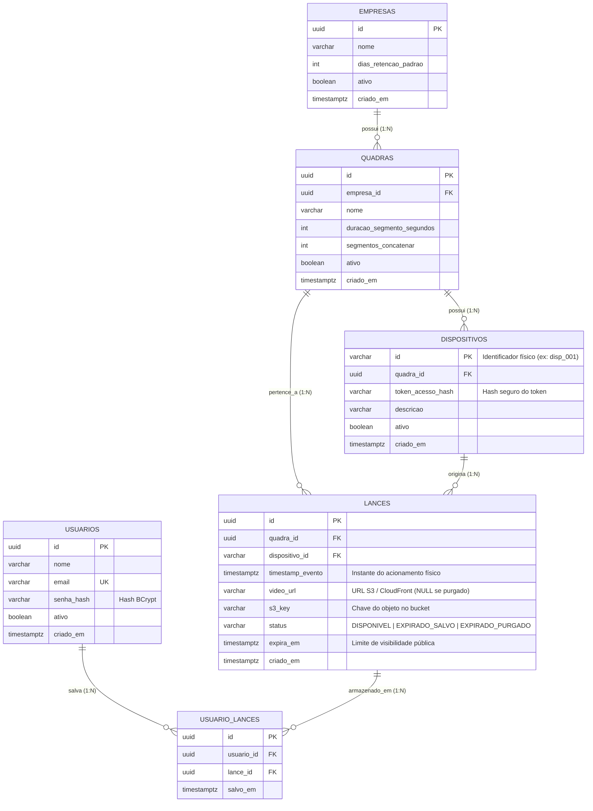
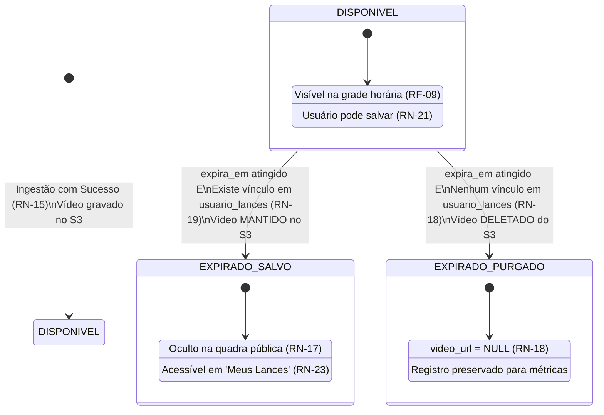

# 🗄️ ClickLance — Modelagem do Banco de Dados (PostgreSQL)

> Documento de arquitetura de dados e engenharia de banco de dados para o Backend Cloud do **ClickLance (MVP)**.  
> Baseado nas especificações formais de [Requisitos e Regras de Negócio](requisitos_e_regras_mvp.md).

---

## 📌 1. Visão Geral e Princípios de Design

A arquitetura do banco de dados foi concebida sob os seguintes pilares:

1. **SGBD Alvo:** **PostgreSQL 15+** utilizando o tipo nativo `UUID` para chaves primárias públicas e segregação multi-tenant.
2. **Isolamento Multi-tenant Lógico:** Todas as entidades pertencem direta ou indiretamente a uma `Empresa`. As consultas são indexadas e filtradas para garantir isolamento estrito sem necessidade de múltiplos schemas no MVP.
3. **Segurança de Hardware (IoT / Edge):** Tokens de dispositivos físicos nunca são expostos em texto puro (`token_acesso_hash`), e chaves físicas (`dispositivo_id`) utilizam identificadores amigáveis ao hardware (ex: `disp_001`).
4. **Ciclo de Vida Híbrido e Otimização de Storage:** O status do lance reflete com precisão seu estado no banco de dados e no AWS S3, viabilizando purga automática de arquivos órfãos sem perder métricas estatísticas.
5. **Prontidão para Migrations (Flyway):** O DDL é estruturado com constraints nomeadas e tipagem estrita para versionamento contínuo.

---

## 🗺️ 2. Diagrama Entidade-Relacionamento (ER)



---

## 📖 3. Dicionário de Dados Detalhado

### 3.1. Tabela `empresas`
Entidade raiz do isolamento multi-tenant. Representa o proprietário/operador das quadras.

| Coluna | Tipo | Nulo | Default | Descrição / Regra de Negócio |
|---|---|:---:|---|---|
| `id` | `UUID` | Não | `gen_random_uuid()` | Chave primária universal. |
| `nome` | `VARCHAR(100)` | Não | — | Razão social ou nome fantasia da empresa. |
| `dias_retencao_padrao` | `INTEGER` | Não | `2` | Quantidade de dias padrão de retenção de lances públicos (*RN-01*). |
| `ativo` | `BOOLEAN` | Não | `TRUE` | Flag para desativação e bloqueio operacional da conta. |
| `criado_em` | `TIMESTAMPTZ` | Não | `CURRENT_TIMESTAMP` | Data/hora de cadastro da empresa no sistema. |

---

### 3.2. Tabela `quadras`
Representa o espaço físico onde as partidas e gravações ocorrem. Centraliza os parâmetros do Edge.

| Coluna | Tipo | Nulo | Default | Descrição / Regra de Negócio |
|---|---|:---:|---|---|
| `id` | `UUID` | Não | `gen_random_uuid()` | Chave primária universal da quadra. |
| `empresa_id` | `UUID` | Não | — | FK para `empresas(id)`. Quadra pertence a uma única empresa (*RN-02*). |
| `nome` | `VARCHAR(100)` | Não | — | Nome da quadra (ex: *"Quadra 1 - Society Coberta"*). |
| `duracao_segmento_segundos` | `INTEGER` | Não | `60` | Parâmetro do DVR do Edge para fatiamento contínuo (*RN-11*). |
| `segmentos_concatenar` | `INTEGER` | Não | `2` | Janela de recuperação do Edge (ex: 2 blocos de 60s = 120s) (*RN-11*). |
| `ativo` | `BOOLEAN` | Não | `TRUE` | Indica se a quadra está em funcionamento. |
| `criado_em` | `TIMESTAMPTZ` | Não | `CURRENT_TIMESTAMP` | Data/hora de registro da quadra. |

---

### 3.3. Tabela `dispositivos`
Representa cada ponto de acionamento físico (botão ou entrada digital do controlador/Arduino).

| Coluna | Tipo | Nulo | Default | Descrição / Regra de Negócio |
|---|---|:---:|---|---|
| `id` | `VARCHAR(50)` | Não | — | PK. Identificador enviado no payload (ex: `disp_001`) (*RN-04*). |
| `quadra_id` | `UUID` | Não | — | FK para `quadras(id)`. Determina a quadra a partir do botão (*RN-03, RN-08*). |
| `token_acesso_hash` | `VARCHAR(255)` | Não | — | Hash criptográfico do token enviado via `X-Device-Token` (*RN-05, RN-07*). |
| `descricao` | `VARCHAR(150)` | Sim | `NULL` | Descrição do hardware (ex: *"Botão Lateral Esquerda - Pino A0"*). |
| `ativo` | `BOOLEAN` | Não | `TRUE` | Somente dispositivos ativos podem injetar lances (*RN-06*). |
| `criado_em` | `TIMESTAMPTZ` | Não | `CURRENT_TIMESTAMP` | Data/hora de vinculação do hardware. |

---

### 3.4. Tabela `lances`
Núcleo da aplicação. Armazena o registro do corte, referência do arquivo no storage e ciclo de vida.

| Coluna | Tipo | Nulo | Default | Descrição / Regra de Negócio |
|---|---|:---:|---|---|
| `id` | `UUID` | Não | `gen_random_uuid()` | Chave primária universal do lance. |
| `quadra_id` | `UUID` | Não | — | FK para `quadras(id)`. Resolvida automaticamente pelo backend (*RN-08*). |
| `dispositivo_id` | `VARCHAR(50)` | Não | — | FK para `dispositivos(id)`. Origem física do acionamento (*RN-13*). |
| `timestamp_evento` | `TIMESTAMPTZ` | Não | — | Momento do clique no botão, base para a grade horária (*RN-09, RN-10*). |
| `video_url` | `VARCHAR(500)` | Sim | `NULL` | URL de reprodução. Fica `NULL` caso o vídeo seja purgado do S3 (*RN-18*). |
| `s3_key` | `VARCHAR(255)` | Não | — | Caminho do objeto no bucket S3 (usado para deleção via SDK) (*RN-20*). |
| `status` | `VARCHAR(25)` | Não | `'DISPONIVEL'` | Enum de ciclo de vida (`DISPONIVEL`, `EXPIRADO_SALVO`, `EXPIRADO_PURGADO`). |
| `expira_em` | `TIMESTAMPTZ` | Não | — | Calculado: `timestamp_evento + dias_retencao` (*RN-16*). |
| `criado_em` | `TIMESTAMPTZ` | Não | `CURRENT_TIMESTAMP` | Instante em que o backend recebeu e processou a notificação. |

---

### 3.5. Tabela `usuarios`
Conta de acesso dos jogadores à plataforma web/mobile.

| Coluna | Tipo | Nulo | Default | Descrição / Regra de Negócio |
|---|---|:---:|---|---|
| `id` | `UUID` | Não | `gen_random_uuid()` | Chave primária do usuário. |
| `nome` | `VARCHAR(100)` | Não | — | Nome completo do jogador. |
| `email` | `VARCHAR(150)` | Não | — | E-mail do usuário (Único no sistema). |
| `senha_hash` | `VARCHAR(255)` | Não | — | Senha criptografada com algoritmo BCrypt. |
| `ativo` | `BOOLEAN` | Não | `TRUE` | Status da conta do jogador. |
| `criado_em` | `TIMESTAMPTZ` | Não | `CURRENT_TIMESTAMP` | Data de cadastro. |

---

### 3.6. Tabela `usuario_lances`
Tabela associativa que implementa a biblioteca pessoal ("Meus Lances").

| Coluna | Tipo | Nulo | Default | Descrição / Regra de Negócio |
|---|---|:---:|---|---|
| `id` | `UUID` | Não | `gen_random_uuid()` | Chave primária do registro da biblioteca. |
| `usuario_id` | `UUID` | Não | — | FK para `usuarios(id)`. Jogador proprietário do lance na carteira. |
| `lance_id` | `UUID` | Não | — | FK para `lances(id)`. Lance salvo (*RN-21*). |
| `salvo_em` | `TIMESTAMPTZ` | Não | `CURRENT_TIMESTAMP` | Data e hora em que o usuário adicionou o lance à sua biblioteca. |

* **Constraint:** `UNIQUE (usuario_id, lance_id)` — Impede duplicidade do mesmo lance na conta (*RN-22*).

---

## 🔄 4. Máquina de Estados do Lance e Ciclo de Vida do Storage

O campo `lances.status` governa a visibilidade e a existência física do arquivo no AWS S3:



---

## ⚡ 5. Estratégia de Índices de Alta Performance

| Índice | Tabela / Colunas | Operação Atendida / Benefício |
|---|---|---|
| **`idx_lances_idempotencia`** | `lances(dispositivo_id, timestamp_evento)` | **Verificação de Duplicação (RN-14):** Busca pontual instantânea para validar requisições repetidas no intervalo de 5 segundos. |
| **`idx_lances_busca_grade`** | `lances(quadra_id, timestamp_evento, status)` | **Grade Horária (RF-09):** Otimiza a cláusula `WHERE quadra_id = ? AND timestamp_evento BETWEEN ? AND ? AND status = 'DISPONIVEL'`. |
| **`idx_lances_expiracao`** | `lances(status, expira_em)` | **Rotina Cron de Expiração (RF-14):** Permite ao batch varrer apenas lances com `status = 'DISPONIVEL' AND expira_em <= NOW()` sem Full Table Scan. |
| **`idx_usuario_lances_lookup`** | `usuario_lances(lance_id)` | **Decisão de Purga do S3:** Verifica em $O(1)$ se o lance expirado possui donos antes de emitir o comando de deleção para a AWS. |
| **`idx_usuario_lances_usuario`** | `usuario_lances(usuario_id, salvo_em DESC)` | **Listagem da Biblioteca (RF-13):** Carrega a tela "Meus Lances" do usuário ordenada cronologicamente. |

---

## 📜 6. Script DDL Oficial (PostgreSQL / Flyway)

Arquivo pronto para uso em: `src/main/resources/db/migration/V1__init_schema.sql`

```sql
-- =============================================================================
-- ClickLance — V1__init_schema.sql
-- Migração inicial do esquema de banco de dados
-- =============================================================================

-- Habilita suporte a geração de UUID v4 nativa
CREATE EXTENSION IF NOT EXISTS "uuid-ossp";

-- -----------------------------------------------------------------------------
-- 1. EMPRESAS (Multi-tenant)
-- -----------------------------------------------------------------------------
CREATE TABLE empresas (
    id UUID PRIMARY KEY DEFAULT uuid_generate_v4(),
    nome VARCHAR(100) NOT NULL,
    dias_retencao_padrao INT NOT NULL DEFAULT 2,
    ativo BOOLEAN NOT NULL DEFAULT TRUE,
    criado_em TIMESTAMPTZ NOT NULL DEFAULT CURRENT_TIMESTAMP,
    CONSTRAINT chk_empresas_retencao CHECK (dias_retencao_padrao > 0)
);

-- -----------------------------------------------------------------------------
-- 2. QUADRAS
-- -----------------------------------------------------------------------------
CREATE TABLE quadras (
    id UUID PRIMARY KEY DEFAULT uuid_generate_v4(),
    empresa_id UUID NOT NULL,
    nome VARCHAR(100) NOT NULL,
    duracao_segmento_segundos INT NOT NULL DEFAULT 60,
    segmentos_concatenar INT NOT NULL DEFAULT 2,
    ativo BOOLEAN NOT NULL DEFAULT TRUE,
    criado_em TIMESTAMPTZ NOT NULL DEFAULT CURRENT_TIMESTAMP,
    CONSTRAINT fk_quadras_empresa FOREIGN KEY (empresa_id) 
        REFERENCES empresas(id) ON DELETE RESTRICT,
    CONSTRAINT chk_quadras_segmento CHECK (duracao_segmento_segundos > 0),
    CONSTRAINT chk_quadras_concat CHECK (segmentos_concatenar > 0)
);

-- -----------------------------------------------------------------------------
-- 3. DISPOSITIVOS (Botões Físicos / Entradas Digitais)
-- -----------------------------------------------------------------------------
CREATE TABLE dispositivos (
    id VARCHAR(50) PRIMARY KEY, -- Identificador de hardware (ex: 'disp_001')
    quadra_id UUID NOT NULL,
    token_acesso_hash VARCHAR(255) NOT NULL,
    descricao VARCHAR(150),
    ativo BOOLEAN NOT NULL DEFAULT TRUE,
    criado_em TIMESTAMPTZ NOT NULL DEFAULT CURRENT_TIMESTAMP,
    CONSTRAINT fk_dispositivos_quadra FOREIGN KEY (quadra_id) 
        REFERENCES quadras(id) ON DELETE RESTRICT
);

-- -----------------------------------------------------------------------------
-- 4. LANCES (Replays)
-- -----------------------------------------------------------------------------
CREATE TABLE lances (
    id UUID PRIMARY KEY DEFAULT uuid_generate_v4(),
    quadra_id UUID NOT NULL,
    dispositivo_id VARCHAR(50) NOT NULL,
    timestamp_evento TIMESTAMPTZ NOT NULL,
    video_url VARCHAR(500),
    s3_key VARCHAR(255) NOT NULL,
    status VARCHAR(25) NOT NULL DEFAULT 'DISPONIVEL',
    expira_em TIMESTAMPTZ NOT NULL,
    criado_em TIMESTAMPTZ NOT NULL DEFAULT CURRENT_TIMESTAMP,
    CONSTRAINT fk_lances_quadra FOREIGN KEY (quadra_id) 
        REFERENCES quadras(id) ON DELETE RESTRICT,
    CONSTRAINT fk_lances_dispositivo FOREIGN KEY (dispositivo_id) 
        REFERENCES dispositivos(id) ON DELETE RESTRICT,
    CONSTRAINT chk_lances_status CHECK (
        status IN ('DISPONIVEL', 'EXPIRADO_SALVO', 'EXPIRADO_PURGADO')
    )
);

-- -----------------------------------------------------------------------------
-- 5. USUÁRIOS (Jogadores)
-- -----------------------------------------------------------------------------
CREATE TABLE usuarios (
    id UUID PRIMARY KEY DEFAULT uuid_generate_v4(),
    nome VARCHAR(100) NOT NULL,
    email VARCHAR(150) NOT NULL,
    senha_hash VARCHAR(255) NOT NULL,
    ativo BOOLEAN NOT NULL DEFAULT TRUE,
    criado_em TIMESTAMPTZ NOT NULL DEFAULT CURRENT_TIMESTAMP,
    CONSTRAINT uk_usuarios_email UNIQUE (email)
);

-- -----------------------------------------------------------------------------
-- 6. USUÁRIO_LANCES (Biblioteca "Meus Lances")
-- -----------------------------------------------------------------------------
CREATE TABLE usuario_lances (
    id UUID PRIMARY KEY DEFAULT uuid_generate_v4(),
    usuario_id UUID NOT NULL,
    lance_id UUID NOT NULL,
    salvo_em TIMESTAMPTZ NOT NULL DEFAULT CURRENT_TIMESTAMP,
    CONSTRAINT fk_usuario_lances_usuario FOREIGN KEY (usuario_id) 
        REFERENCES usuarios(id) ON DELETE CASCADE,
    CONSTRAINT fk_usuario_lances_lance FOREIGN KEY (lance_id) 
        REFERENCES lances(id) ON DELETE RESTRICT,
    CONSTRAINT uk_usuario_lance UNIQUE (usuario_id, lance_id)
);

-- -----------------------------------------------------------------------------
-- CRIAÇÃO DE ÍNDICES ESTRATÉGICOS
-- -----------------------------------------------------------------------------

-- 1. Otimização de Idempotência do Edge (Tolerância de 5 segundos)
CREATE INDEX idx_lances_idempotencia 
    ON lances(dispositivo_id, timestamp_evento);

-- 2. Otimização da Grade Horária Pública por Quadra e Status
CREATE INDEX idx_lances_busca_grade 
    ON lances(quadra_id, timestamp_evento, status);

-- 3. Otimização da Rotina Agendada (Cron) de Expiração e Purga
CREATE INDEX idx_lances_expiracao 
    ON lances(status, expira_em);

-- 4. Otimização de Verificação de Donos do Lance antes de purgar do S3
CREATE INDEX idx_usuario_lances_lance 
    ON usuario_lances(lance_id);

-- 5. Otimização de Listagem da Biblioteca Pessoal do Jogador
CREATE INDEX idx_usuario_lances_usuario 
    ON usuario_lances(usuario_id, salvo_em DESC);
```

---

## 🔮 7. Prontidão para Extensibilidade Futura (Fase 2: Pagamentos)

A modelagem foi concebida para permitir a adição da camada de monetização **sem necessidade de refatorar nenhuma tabela existente**:

```
[Usuario] ──(1:N)──> [Pedido] ──(1:N)──> [ItemPedido] ──(N:1)──> [Lance]
                       │
                     (1:1)
                       │
                       └───> [Pagamento (PIX / Webhook)]
```

Ao confirmar um `Pagamento`, o backend simplesmente executa um `INSERT INTO usuario_lances (usuario_id, lance_id)` liberando o lance de forma idêntica ao fluxo atual.
